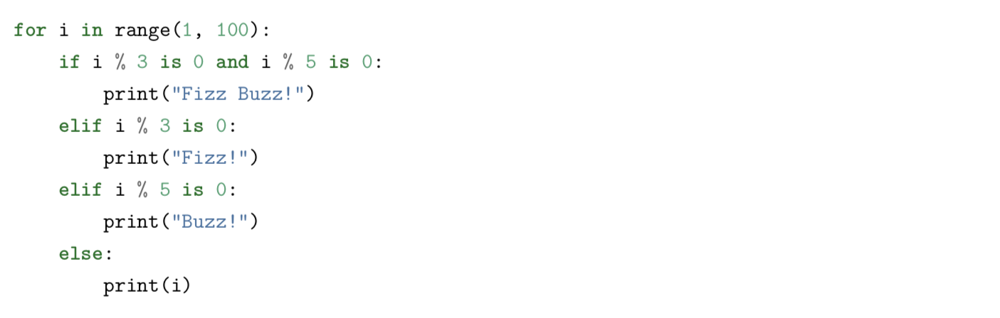
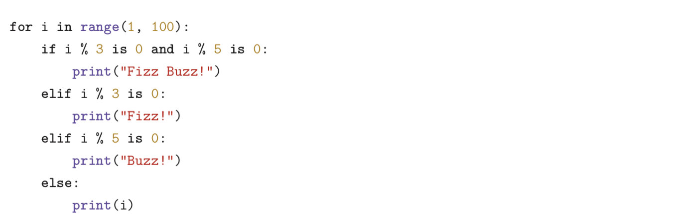
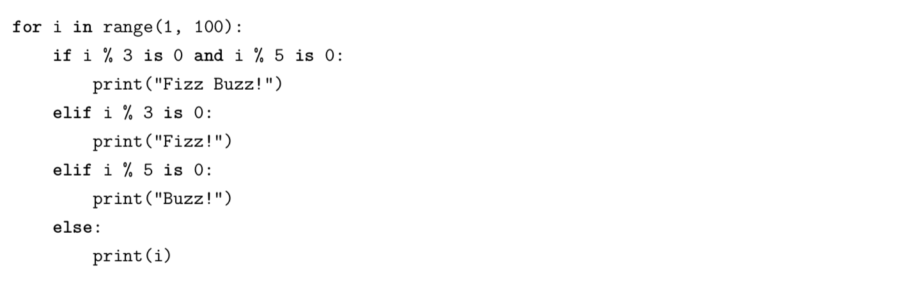
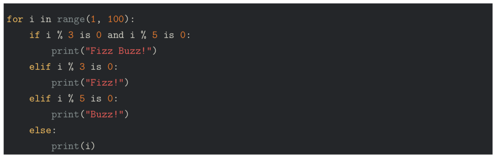
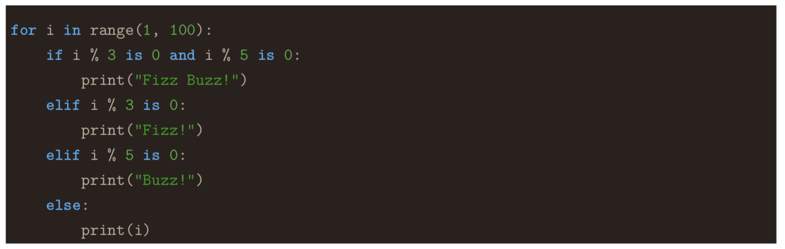
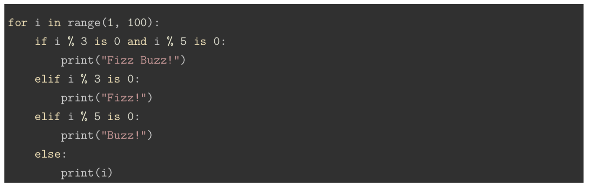
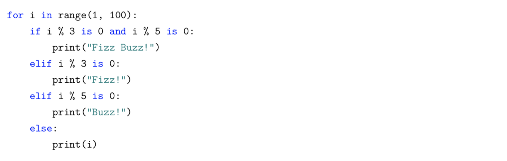
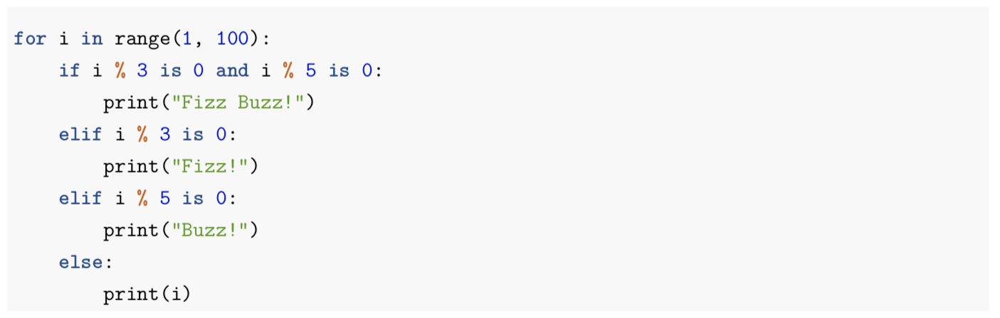

# Pandoc Syntax Highlighting Color Schemes Examples

[](LICENSE)

## Summary

Pandoc has several color schemes for syntax highlighting, which are `pygments` (the default), `kate`, `monochrome`, `breezeDark`, `espresso`, `zenburn`, `haddock`, and `tango`.

## How to generate pdf from markdown

Here is an sample command to generate pdf from a markdown file.

```sh
pandoc test.md -s -o pygments.pdf --highlight-style=pygments --latex-engine=lualatex -V documentclass=ltjarticle -V geometry:margin=1in
```

Here is an input.

```py
for i in range(1, 100):
    if i % 3 is 0 and i % 5 is 0:
        print("Fizz Buzz!")
    elif i % 3 is 0:
        print("Fizz!")
    elif i % 5 is 0:
        print("Buzz!")
    else:
        print(i)
```

## Color Schemes

### pygments



### kate



### monochrome



### breezeDark



### espresso



### zenburn



### haddock



### tango


